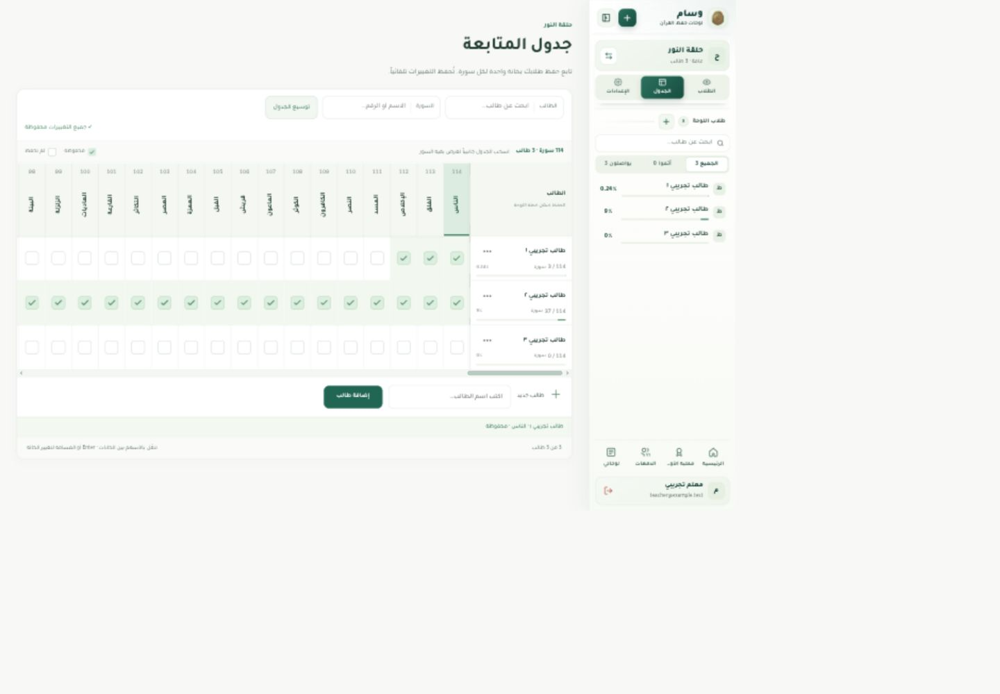
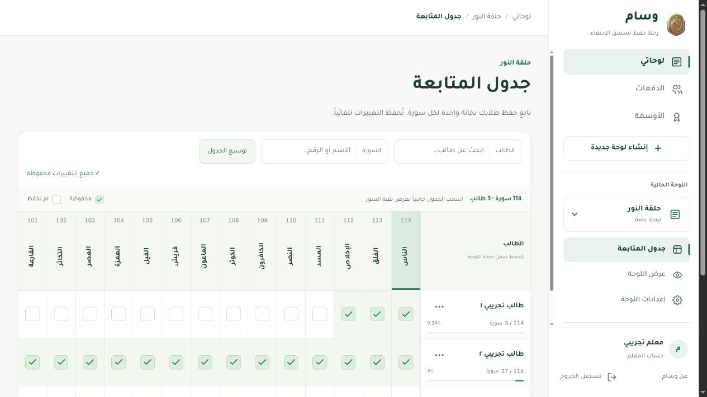
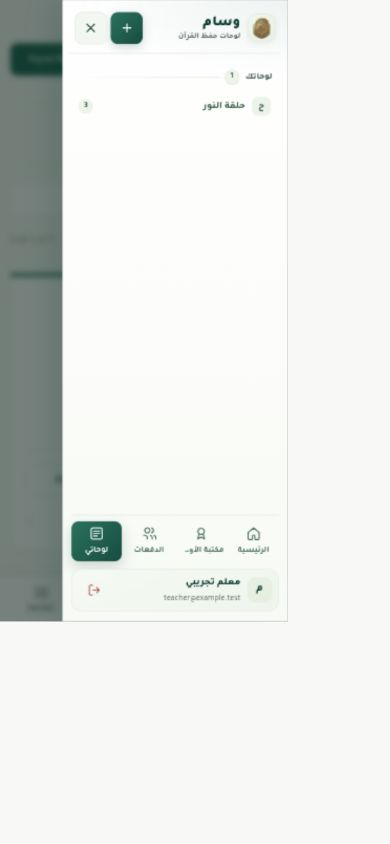
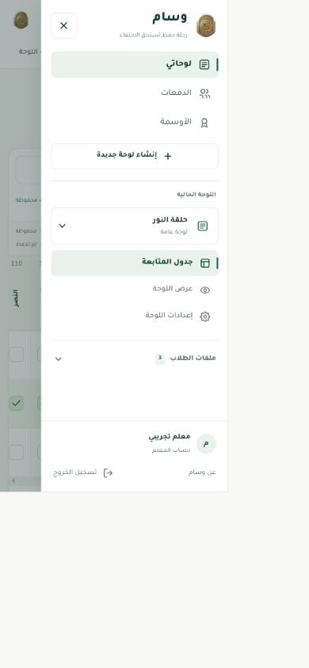
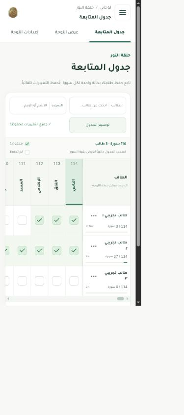
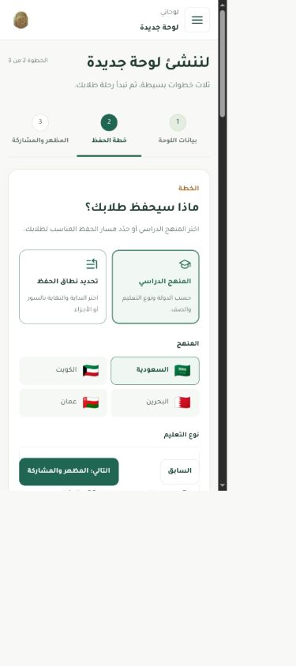
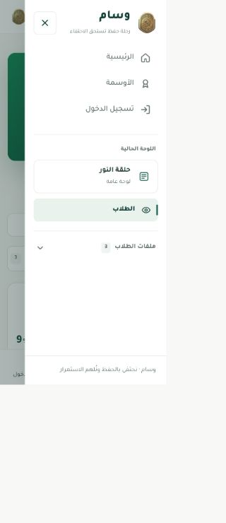
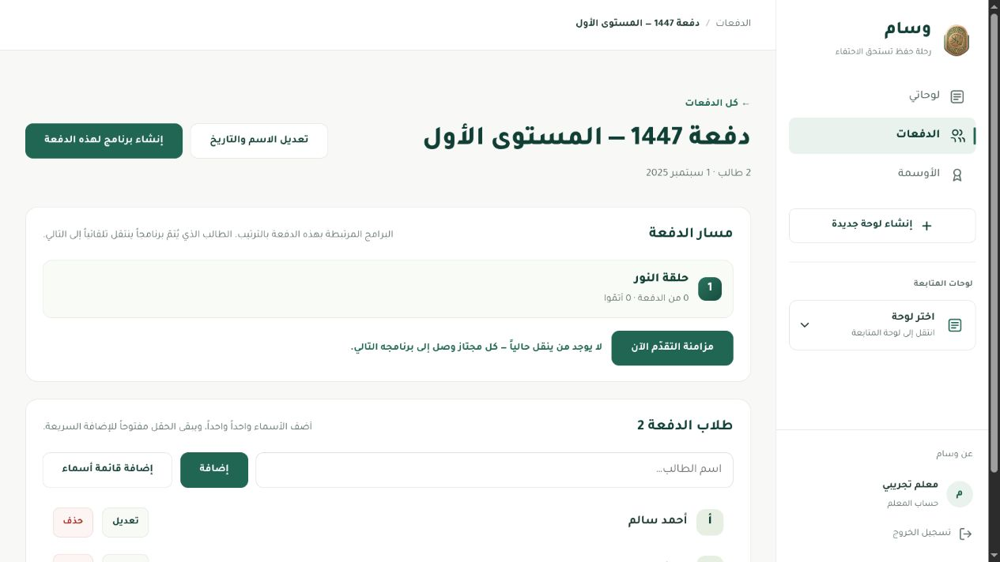

# Sidebar and navigation redesign

The app now uses one primary navigation system: a permanent labelled sidebar on desktop and the same sidebar in an accessible drawer on phones. The bottom navigation has been removed at the user’s request. The sticky mobile header retains the menu button and current location, with local board links for owners.

## Captured findings and resulting flow

### 1. Locate the main destinations — improved

Before: board controls and student filtering dominated the top of the sidebar, while tiny main destinations sat at its foot. They competed with several icon-only creation and collapse controls.

After: **لوحاتي، الدفعات، الأوسمة** appear as labelled rows in a stable order. A separate board section contains the current board and its pages. Creation leads to the existing guided setup. The account footer is compact enough to leave the board destinations visible at ordinary desktop heights.

### 2. Navigate on a phone — improved and verified

Before: the sidebar repeated the bottom bar; a bottom destination changed from boards to a worksheet or public roster as context changed. The main destinations were pushed far down the drawer.

After: the primary navigation lives entirely in the sidebar, opened from the persistent header. The bottom bar and its reserved spacing are gone. The main and board sections are clearly separated; student profiles are optional shortcuts. Setup actions retain device safe-area spacing.

### 3. Switch boards and visit student profiles — verified

The switcher has search, an explicit empty result, and a link to all boards. Searching a missing name, then a matching name and selecting the board worked. Student shortcuts are alphabetical on every page; rank changes cannot reorder them. They open automatically for a selected student. Current pages and their parent sections have distinct `aria-current` semantics. Back/Forward restored the worksheet and profile.

The retired inline board/student edit forms, duplicated student filters, progress meters and collapse controls were removed from navigation. Editing remains in the worksheet and setup/settings pages.

### 4. Use keyboard navigation and private/public routes — verified within the local fixture

Tab and Shift+Tab wrap inside the phone drawer. Escape closes an expanded board picker and returns focus to the switcher; the next Escape closes the drawer and returns focus to the header button. The background is isolated while the drawer is open. Switching back to desktop restores nonmodal navigation.

Private boards omit public links, including while their metadata is loading. Sign-out clears teacher context and redirects protected pages; fixture sign-in returned to the requested worksheet. The guest sidebar contains public navigation and no teacher editing links. The 320px guest drawer fitted without clipped controls.

### 5. Recognize a nested page — improved and verified

Student profiles display their name and a board parent link. Cohort details display their name and a link back to the cohort list; the list is marked as the parent section rather than the current page. Scoped page location updates cannot outlive a route visit.

## Research applied

- [NN/g’s menu-design checklist](https://www.nngroup.com/articles/menu-design/) supports visible desktop navigation, clear consistent labels and identifiable location. Those principles informed the main rows, board grouping and location trail.
- [Google’s adaptive navigation guidance](https://developer.android.com/develop/adaptive-apps/guides/build-adaptive-navigation) supports adapting navigation to screen space with a shared destination model. The user selected a sidebar on both screen sizes, so the app uses permanent and modal forms of that sidebar.
- [W3C disclosure navigation](https://www.w3.org/WAI/ARIA/apg/patterns/disclosure/examples/disclosure-navigation/) informed native links/disclosures without ARIA menu roles. [W3C modal dialog guidance](https://www.w3.org/WAI/ARIA/apg/patterns/dialog-modal/) informed focus containment, Escape and focus return.

## Validation and limits

- `npm run verify`: **118 tests passed** and **59 runtime modules** passed syntax, imports, architecture boundaries, reachability and resource checks.
- `git diff --check`: passed.
- Browser checks: main navigation, board search and selection, student shortcuts, Back/Forward, private routes, guest navigation, sign-out/return, nested cohort location, keyboard containment, responsive drawer and setup navigation. Final DOM inspection confirmed zero bottom-navigation elements.
- Screens inspected at 320px, 390px, desktop 1440px, and the normal in-app browser size. Interim screenshots in this folder are retained as iteration evidence; the final mobile state is shown in images 13 and 14.
- Local preview checks use the real router/pages with in-memory services. Live Google sign-in, production Firebase writes and deployment were not exercised. Screen-reader/device testing and moderated usability testing were not performed; no full accessibility-compliance claim is made.
- Firestore rule tests remain outside this UI check; the earlier emulator run was blocked by missing Java.

## Repeatable check

Run `npm run dev`, then open `/tests/ui/preview.html?page=students`. On desktop, select each main section and a board, expand/search student shortcuts, open a profile, and use Back/Forward. At 390px, open the sidebar from the header, exercise Tab/Shift+Tab/Escape, switch boards, navigate to setup, and verify action-bar spacing. Repeat with `privateBoard=1`, `guest=1`, and `loadDelay=1000`. Check that loading/private contexts do not expose public destinations and that no bottom navigation returns.

The implementation contract and module ownership are documented in [navigation architecture](../../sidebar-navigation.md).
